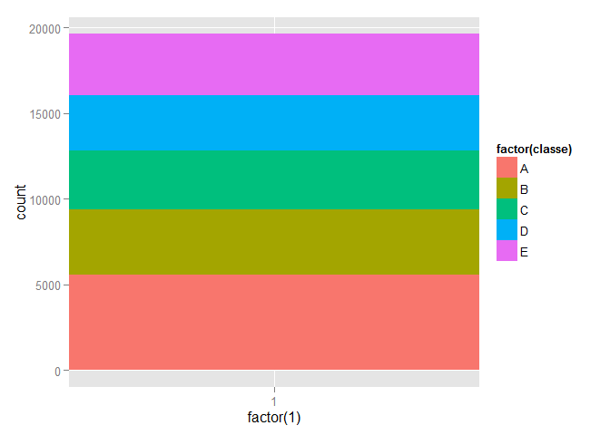
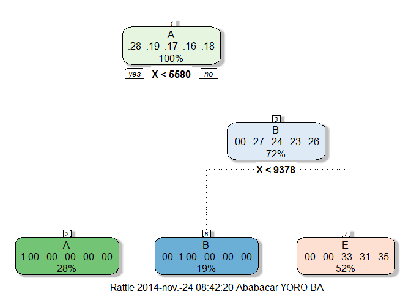

# Practical Machine Learning : Prediction Assignment
Ababacar Yoro Ba  
Sunday, November 23, 2014  

  Using devices such as Jawbone Up, Nike FuelBand, and Fitbit it is now possible to collect a large amount of data about personal activity relatively inexpensively. These type of devices are part of the quantified self movement - a group of enthusiasts who take measurements about themselves regularly to improve their health, to find patterns in their behavior, or because they are tech geeks. One thing that people regularly do is quantify how much of a particular activity they do, but they rarely quantify how well they do it. In this project, our goal will be to use data from accelerometers on the belt, forearm, arm, and dumbell of 6 participants. They were asked to perform barbell lifts correctly and incorrectly in 5 different ways. More information is available from the website here: <http://groupware.les.inf.puc-rio.br/har> (see the section on the Weight Lifting Exercise Dataset).
  
 The goal of this project is to predict the manner in which they did the exercise. This is the "classe" variable in the training set. You may use any of the other variables to predict with.  
 Data can be found at  : 

* Training data : <https://d396qusza40orc.cloudfront.net/predmachlearn/pml-training.csv>

* Testing data : <https://d396qusza40orc.cloudfront.net/predmachlearn/pml-testing.csv>


```r
# download.file("https://d396qusza40orc.cloudfront.net/predmachlearn/pml-training.csv", destfile = "D:/")
# That's what we should use, but for not losing time, we use the following
setwd("D:\\Coursera\\Data science\\Practical Machine Learning\\Week 3")
training = read.csv("pml-training.csv")
testing.dataset = read.csv("pml-testing.csv")
library(ggplot2)
library(caret)
```

Before anything, we gonna perform a exploratory analysis to have a glimpse on data.

## 1. Exploratory analysis

The variable of interest is the "classs" variable. This is a factor variable with A, B, C, D and E as levels. This variable represents the way the exercice were done.

```r
ggplot(training, aes(x = factor(1), fill = factor(classe))) +
  geom_bar(width = 1)
```

 
  Through the following plot, we see that levels of the classe variable are almost identically distributed, exepted the A which seems to be more represented in the population. 
  
## 2. Pre-processing

The dataset we have is made up of a variety of variable we don't necessary need for predicting. First of all, we remove all zero variables with the following code.


```r
# Removing zero covariates
nsv = nearZeroVar(training, saveMetrics = T)
# New vector of covariates
nonZeroVar = rownames(nsv[nsv$nzv == F,])
# New training data
trainingNonZero = training[, nonZeroVar]
```

Even after this preprocessing, we notice that a bunch of variables have a lot of missing values. So we chose to remove from de covariates all variable that has a number of NAs higher than the **third** or the dataset's length.


```r
var = vector("numeric")
for (i in colnames(trainingNonZero)) {
  if (!(sum(is.na(trainingNonZero[, i])) > dim(trainingNonZero)[1]/3) ) var = c(var, i)
}

trainingNonZeroNonNa = trainingNonZero[, var]
```

Now, we consider that we have a tidy dataset that we can use to train a model for predicting the classe variable.

## 3. Fitting a model

As we have a factor variable, we have the choice between the prediction with trees, random forests and the boosting method. We have choosen to use random forests to predict. 


```r
# New training and testin datasets
inTrain <- createDataPartition(y=trainingNonZeroNonNa$classe,
                              p=0.7, list=FALSE)
training <- trainingNonZeroNonNa[inTrain,]
testing <- trainingNonZeroNonNa[-inTrain,]

modFit = train(classe ~., method = "rpart", data = training)
```

```
## Loading required package: rpart
```

```r
print(modFit)
```

```
## CART 
## 
## 13737 samples
##    58 predictor
##     5 classes: 'A', 'B', 'C', 'D', 'E' 
## 
## No pre-processing
## Resampling: Bootstrapped (25 reps) 
## 
## Summary of sample sizes: 13737, 13737, 13737, 13737, 13737, 13737, ... 
## 
## Resampling results across tuning parameters:
## 
##   cp   Accuracy  Kappa  Accuracy SD  Kappa SD
##   0.2  0.7       0.7    0.09         0.1     
##   0.3  0.6       0.4    0.09         0.1     
##   0.3  0.4       0.2    0.10         0.2     
## 
## Accuracy was used to select the optimal model using  the largest value.
## The final value used for the model was cp = 0.2437.
```

```r
library(rattle)
```

```
## Rattle : une interface graphique gratuite pour l'exploration de données avec R.
## Version 3.3.0 Copyright (c) 2006-2014 Togaware Pty Ltd.
## Entrez 'rattle()' pour secouer, faire vibrer, et faire défiler vos données.
```

```r
library(rpart.plot)
fancyRpartPlot(modFit$finalModel)
```

```
## Warning: unable to identify current timezone 'T':
## please set environment variable 'TZ'
## Warning: unknown timezone 'localtime'
```

 

```r
library(randomForest)
```

```
## randomForest 4.6-10
## Type rfNews() to see new features/changes/bug fixes.
```

```r
modFit = randomForest(classe ~., data = training)
print(modFit)
```

```
## 
## Call:
##  randomForest(formula = classe ~ ., data = training) 
##                Type of random forest: classification
##                      Number of trees: 500
## No. of variables tried at each split: 7
## 
##         OOB estimate of  error rate: 0.01%
## Confusion matrix:
##      A    B    C    D    E class.error
## A 3906    0    0    0    0   0.0000000
## B    1 2657    0    0    0   0.0003762
## C    0    1 2395    0    0   0.0004174
## D    0    0    0 2252    0   0.0000000
## E    0    0    0    0 2525   0.0000000
```

We can see that the 00B estimate error rate of our model is **0%**.

## 4. Testing the model

With the model fitted below, we are going to predict the values for the testing dataset


```r
pred <- predict(modFit,testing); testing$predRight <- pred==testing$classe
table(pred,testing$classe)
```

```
##     
## pred    A    B    C    D    E
##    A 1674    0    0    0    0
##    B    0 1139    0    0    0
##    C    0    0 1026    0    0
##    D    0    0    0  964    0
##    E    0    0    0    0 1082
```

Here also, we find that there is no error in our classification.
Lets apply our algorithm to the 20 new values.


```r
testing = testing.dataset[, intersect(colnames(testing.dataset), var)]
testing$classe = ""
#predictionsB2 <- predict(modFit, testing, type = "class")

pml_write_files = function(x){
  n = length(x)
  for(i in 1:n){
    filename = paste0("problem_id_",i,".txt")
    write.table(x[i],file=filename,quote=FALSE,row.names=FALSE,col.names=FALSE)
  }
}

#pml_write_files(predictionsB2)
```

